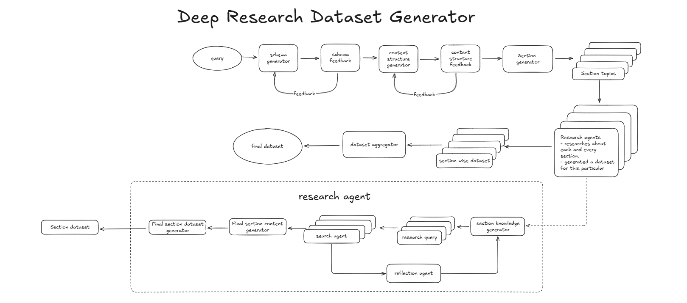

<div align="center">
  
</div>
<br/>
<br/>
<div align="center">
  
</div>

## Overview

Datalore is a terminal tool for generating structured datasets from real-world data using deep research. You describe the kind of dataset you need, and it automatically searches across the web, builds context through multi-step research, suggests a schema, and outputs clean, usable data. It’s built for quick experimentation, training tasks, or anytime you need structured data without manually gathering or formatting it.


## How It Works

- takes a **query** describing the dataset you want  
- suggests a high-level **schema** based on the query  
- refines the **schema** with follow-up adjustments if needed  
- breaks the dataset into focused **sections** and **subtopics**  
- assigns a **research agent** to each section  
- each agent runs **web search**, extracts info, and summarizes key data  
- generates **section-wise** structured **data**  
- merges all sections into a single final **dataset**  
- saves the dataset in the `output_files` **directory** via the terminal  


## Workflow

This diagram shows how Datalore takes a user prompt, performs recursive web research, and turns the results into a structured dataset.



## Getting Started

Follow these steps to set up and run the project locally.

### Prerequisite: Install `uv`

`uv` is required to manage the virtual environment and dependencies.

You can download it from the official [uv GitHub repository](https://github.com/astral-sh/uv), which includes platform-specific installation instructions.


### 1. Clone the Repository

Clone the repository:

```bash
git clone https://github.com/Datalore-ai/datalore-deepresearch-cli.git
cd datalore-deep-research-cli
```

### 2. Create a Virtual Environment

Use `uv` to create a virtual environment:

```bash
uv venv
```

### 3. Activate the Virtual Environment

Activate the environment depending on your operating system:

**Windows:**
```bash
.venv\Scripts\activate
```

**macOS/Linux:**
```bash
source .venv/bin/activate
```

### 4. Set Up Environment Variables

Copy the example `.env` file and add your API keys:

```bash
cp .env.example .env
```

Open the `.env` file in a text editor and fill in the required fields:

```
OPENAI_API_KEY=your_openai_api_key_here
TAVILY_API_KEY=your_tavily_api_key_here
```

These keys are essential for the application to work correctly.

### 5. Install Dependencies

```bash
uv pip install -r requirements.txt
```

This will install all required packages as defined in your `requirements.txt`.

### 6. Run the Application

Once installed and configured, start the app with:

```bash
python main.py
```

You're all set to go! The application will now guide you through the dataset creation process step by step and the final dataset will be saved in the output_files directory.

### Optional: `configuration.py`

You can customize how the tool behaves using the `configuration.py` file inside `deep_research_workflow`. It lets you adjust things like model type, temperature, search depth, delays, and more.

```python
from dataclasses import dataclass, fields
from langchain_core.runnables import RunnableConfig
import os
import uuid

@dataclass(kw_only=True)
class Configuration:
    thread_id: str = str(uuid.uuid4())
    provider: str = "openai"
    model: str = "gpt-4o-mini"
    temperature: float = 0.5
    max_queries: int = 3
    search_depth: int = 2
    num_reflections: int = 2
    section_delay_seconds: int = 15
    max_rows_from_each_section: int = 5

    @classmethod
    def from_runnable_config(cls, config: RunnableConfig) -> "Configuration":
        configurable = config.get("configurable", {}) if config else {}
        values = {
            f.name: os.environ.get(f.name.upper(), configurable.get(f.name, f.default))
            for f in fields(cls) if f.init
        }
        return cls(**values)
```

## Coming Soon

- [ ] Citations for datasets, showing all resources used  
- [ ] Support for exporting datasets in multiple formats (CSV, JSON, Parquet)  
- [ ] Caching system to speed up repeated queries
- [ ] Integration with AI summarizers for quick dataset overviews    

##  Authors
 
- [Swaraj Biswal](https://github.com/SWARAJ-42)
- [Swadhin Biswal](https://github.com/swadhin505) 


## Contributing

If something here could be improved, please open an issue or submit a pull request.

### License

This project is licensed under the MIT License. See the `LICENSE` file for more details.

